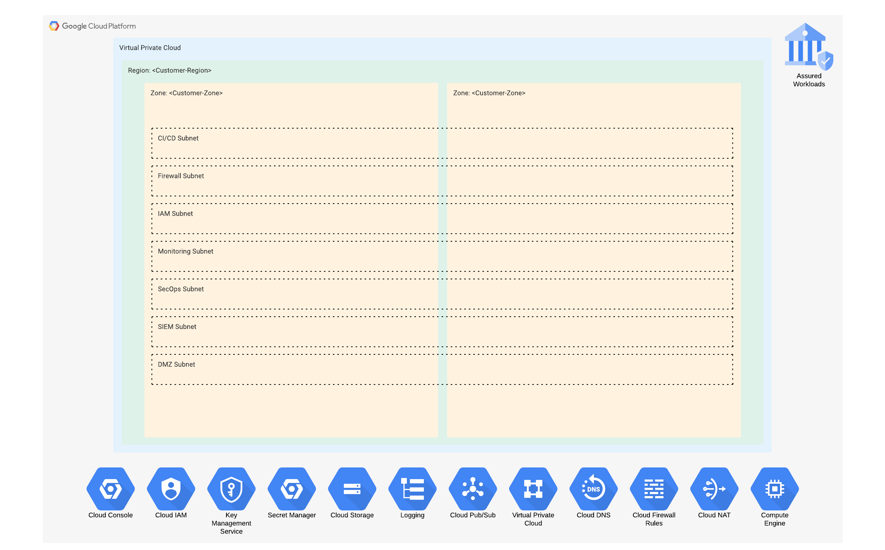

# Coalfire GCP RAMPpak

Coalfire created reference architecture for FedRAMP Google Cloud builds. This repository is used as a parent directory to deploy `Coalfire-CF/terraform-google-<service>` modules.

Learn more at [Coalfire OpenSource](https://coalfire.com/opensource).

[Get our SSP Templates and Reference Architecture Design Document Template](https://www.coalfire.com/services/fedramp/ramp-pak-documentation)

## Architecture

## Tooling

- [gcloud CLI](https://cloud.google.com/sdk/gcloud) (435.0.0)
- [Terraform](https://www.terraform.io/downloads) (1.5.0)
- [Terraform Google Cloud Platform Provider Provider](https://registry.terraform.io/providers/hashicorp/google) (4.70.0)

## Dependencies

1. [Setup Cloud Identity](https://cloud.google.com/identity/docs/set-up-cloud-identity-admin) and [verify your domain](https://cloud.google.com/identity/docs/verify-domain).
2. After Cloud Identity has been configured, [create an organization](https://cloud.google.com/resource-manager/docs/creating-managing-organization).
    - Turn on 2-Step Verification enforcement.
3. Create `grp-gcp-org-admins@your-domain.com` group in Cloud Identity and add members.
    - Add **Security** label to group.
    - Select **Restricted** Access type.
4. Create FedRAMP Moderate Assured Workloads folder in [Cloud Console](https://console.cloud.google.com/) on the **Assured Workloads** page. Assured Workloads is required for FedRAMP compliance as Google doesn't have a GovCloud offering.
    - Compliance type: **FedRAMP Moderate**
    - Region: **US**
    - Folder location: **choose organization**
    - Folder name: `fldr-assured-workloads`
    - Review and create folder

## Deployment Order of Operations

1. Dependencies
2. [Security Core](organization/security-core/README.md)
3. [Networking Setup](organization/networking/README.md)
5. [Bastions](organization/bastions/README.md)

## Deployment Configurations

Each folder, e.x. `organization/security-core` has a README that provides configuration steps, documents outputs, dependencies, and other notes on each component in the environment.

### Modifications when new Admins are added

- Add new user in [Admin console](https://admin.google.com)
- Add new user as member to `grp-gcp-org-admins@your-domain.com` group

## Environment Setup

- Download and install the gcloud CLI - https://cloud.google.com/sdk/gcloud#download_and_install_the
- Create a new configuration - `gcloud config configurations create <name>`
- Activate the new configuration - `gcloud config configurations activate <name>`
- Authenticate gcloud with new configuration - `gcloud auth application-default login`

## Resources

- [Creating and managing organization resources](https://cloud.google.com/resource-manager/docs/creating-managing-organization#acquiring)
- [Create an Assured Workloads folder](https://cloud.google.com/assured-workloads/docs/create-folder)
- [Google Cloud FedRAMP implementation guide](https://cloud.google.com/architecture/fedramp-implementation-guide)
- [Google Cloud services and authorized regions that are covered by FedRAMP](https://cloud.google.com/security/compliance/fedramp)

## Contributing

If you're interested in contributing to our projects, please review the [Contributing Guidelines](CONTRIBUTING.md). And send an email to [our team](contributing@coalfire.com) to receive a copy of our CLA and start the onboarding process.

## License

### Copyright

Copyright © 2023 Coalfire Systems Inc.
<!-- BEGIN_TF_DOCS -->
## Requirements

No requirements.

## Providers

No providers.

## Modules

No modules.

## Resources

No resources.

## Inputs

No inputs.

## Outputs

No outputs.
<!-- END_TF_DOCS -->